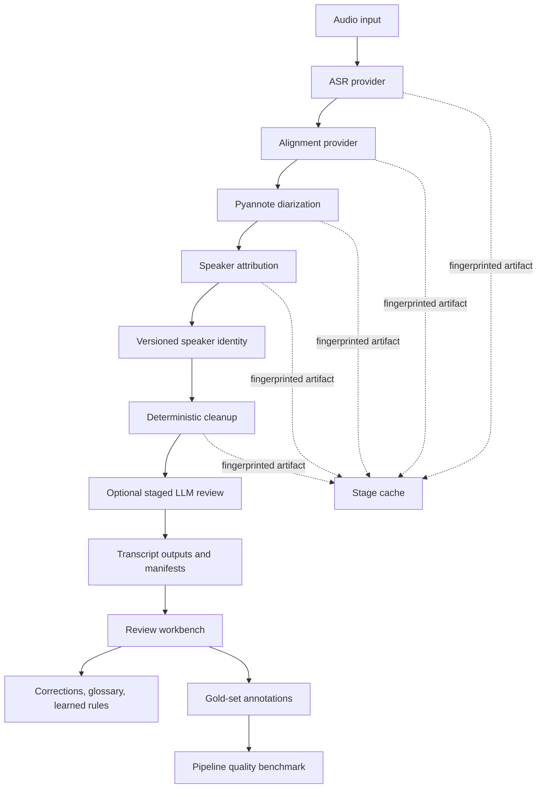

# Architecture

`podcast-host-transcription-pipeline` is a local-first, stage-oriented speech pipeline. Its stable public surface remains the root PowerShell launcher, transcript contracts, and additive output families. Internally, expensive model stages now carry provider identities and fingerprints so compatible work can be reused selectively.

## Processing Flow

## Contract and Evidence Control Plane

`episode-contract-v2` makes bundle completeness independent from the older resume marker. The classifier can choose a JSON-only delta promotion, a cached rebuild, or a full tier-1 reprocess. A JSON-only promotion is allowed only when the bundle already proves completion of embedding-backed speaker identity evidence; otherwise cached stages are reused and missing speaker evidence is rebuilt from source audio. Legacy JSON/manifests are archived before canonical replacement, and completed v2 provenance prevents repeated upgrades.

Human changes flow through `correction-manifest-v2`. The workbench writes corrected siblings and a compatibility CSV, then emits downstream notifications containing the correction-set ID and affected source spans. Podcast-RAG can plan selective document deltas; RAGScope can route stale judgments back to adjudication.

Speaker attribution writes embedding evidence while the model is already loaded. The workbench clusters only compatible evidence vectors across episodes, so reusable diarization labels never become accidental identities. `speakers.json` schema v2 retains explicit promotion, role, merge/split, and rollback history.

The private evaluation pack is configured separately from the repository. Workbench queues and the guided campaign operate on that path, while only aggregate benchmark results and synthetic contract fixtures are suitable for Git.

## Stable Baseline

The default provider set intentionally reproduces the established pipeline:

- ASR: `faster_whisper` with the configured Whisper model
- alignment: `timestamp_passthrough`, preserving ASR-native word timestamps
- diarization: pyannote Community-1 with learned long-file chunk routing
- speaker embedding: `speechbrain_ecapa`
- deterministic cleanup followed by optional local LLM review

Changing no provider settings should preserve existing output behavior.

The current validated Windows GPU dependency set is PyTorch 2.9 with CUDA 12.8 wheels, TorchAudio 2.9, TorchVision 0.24, TorchCodec 0.8.1, and a shared FFmpeg 7 build. On Windows the runtime preloads DLLs from the configured `ffmpeg_bin_dir` before importing TorchCodec, preventing an incompatible FFmpeg elsewhere on `PATH` from intercepting ABI discovery. TorchCodec is used opportunistically for path-based pyannote audio input; the pipeline retains its own chunked loader and long-file fallback when the native decoder or global clustering cannot handle an episode safely.

## Launcher and Review Backend Control Plane

The root PowerShell launcher is the operator control plane. Interactive use stays in a menu loop after each completed or failed action and exits only when the operator selects `Q`. Explicit invocations such as `-Action Debug` remain one-shot so automation does not become interactive unexpectedly.

Launcher option `7` configures the shared external review backend used by:

- staged transcript review and tier-2 backfill
- review-model benchmarking
- workbench semantic scans
- Teach-Me rule induction and validation

The wizard accepts an IP address, hostname, or HTTP(S) URL; probes OpenAI-compatible model endpoints; distinguishes vLLM from LM Studio; filters LM Studio entries to chat-capable model types; and verifies the selected model through a lightweight chat-completions request. It updates only the backend URL/model keys plus review profile or stage keys explicitly chosen by the operator. Every successful write is validated, backed up, encoded as UTF-8 without a BOM, and atomically replaces the prior project config.

The backend remains a local/LAN boundary. API-key and cloud-provider credential management are intentionally outside this control plane.

## Provider Contracts

Provider interfaces live under `src/podcast_transcribe/providers/`.

- `ProviderIdentity` records stage, provider, model, implementation version, package version, and capabilities.
- `StageResult` carries normalized stage output, provider identity, and additive metadata.
- ASR providers produce `SegmentItem` instances with optional word timing.
- alignment providers accept normalized ASR segments and return the same contract with revised timing.
- speaker embedding providers expose a versioned identity so incompatible vectors cannot be mixed.

The optional `whisperx` alignment provider is imported lazily. Its dependency stack is not loaded or required by the baseline path.

## Stage Fingerprints and Reuse

Resumable artifacts under `_processing_artifacts/<episode>/` use an additive version-2 envelope containing:

- source-audio fingerprint
- provider identity
- stage configuration fingerprint
- dependency fingerprints
- normalized stage payload

Artifacts are written through an atomic temporary-file replacement. A process interruption therefore leaves either the prior complete artifact or the new complete artifact; malformed partial JSON is rejected and recomputed.

Reuse follows the dependency graph:

| Changed input | Work that can remain reusable |
|---|---|
| LLM review model or rules | ASR, alignment, diarization, speaker attribution, cleaned JSON |
| cleanup or glossary configuration | ASR, alignment, diarization, speaker attribution |
| speaker profile/provider | ASR, alignment, diarization |
| alignment provider/model | ASR and diarization |
| ASR provider/model | independent diarization only |
| audio fingerprint | nothing for that episode |

The complementary invalidation view is:

| Changed input | Stages recomputed |
|---|---|
| ASR provider/model/config | ASR, alignment, speaker attribution, cleanup |
| alignment provider/model | alignment, speaker attribution, cleanup |
| diarization provider/model/config | diarization, speaker attribution, cleanup |
| speaker embedder/profile inputs | speaker attribution and cleanup |
| cleanup level/glossary/correction CSV | deterministic cleanup only |

Legacy stage artifacts without fingerprints remain readable only for the established baseline assumptions. Newly written artifacts carry strict fingerprints. Speaker attribution persists labels and evidence, not embedding tensors; incompatible embedding families therefore cannot be mixed accidentally.

When `resume_intermediates` is enabled, successful runs retain the reusable stage artifacts. Disabling resume allows normal cleanup of those artifacts.

## Alignment

Alignment is now a first-class stage between transcription and speaker assignment.

- `timestamp_passthrough` is the default and makes no semantic changes.
- `whisperx` performs forced alignment and is opt-in.
- alignment artifacts depend on the ASR fingerprint, so changing alignment does not rerun ASR.
- aligned word timing flows into the existing diarization-to-word speaker assignment logic.

## Speaker Profile Contract

Host profiles use schema version 2 and record:

- embedding provider and model
- embedding dimension
- L2 normalization
- source episode and update provenance
- embedding vector

Legacy profiles are treated as ECAPA profiles. A versioned profile is rejected when its provider/model differs from the active speaker embedding provider.

## Long-File Diarization Routing

The diarization orchestrator uses a deterministic frontier-plus-probe policy. It first attempts global diarization unless runtime-scoped history identifies the episode as clearly risky. A pyannote clustering `MemoryError` records a failure and immediately retries with overlapping chunks. Successful global runs record safe durations; later successes can invalidate shorter historical failures.

The near-frontier probe band is 30 minutes above the current failure floor. Probing is suppressed when the cooldown has not expired or one of the last five probe decisions failed within 15 minutes of the current duration. Chunked runs reconcile adjacent chunk speakers conservatively and expose mode, probe, chunk, overlap, and ambiguity metadata without changing the downstream diarized-turn contract.

## Review Intelligence

The optional review layer is staged and additive. Cleanup, glossary, speaker consistency, and episode QA each have explicit prompts, edit scopes, adaptive budgets, protected-term validation, and stage-level provenance. Calibration runs once per processing run using real transcript text; production windows adapt downward on overflow and upward only after conservative success streaks. Overflow is retried at smaller windows rather than treated as an ordinary skip; only hard backend failures at the minimum floor can leave a stage incomplete.

Approved project-local Teach-Me rules are passed to the relevant review stage as constrained guidance. They are never executable code, cannot override preferred-term protection, and are recorded in reviewed metadata and workbench audit artifacts.

Review-backend configuration is centralized in `podcast_transcribe_config.json`. Changing the selected model invalidates review-specific fingerprints and calibration hints without invalidating reusable ASR, alignment, diarization, speaker-attribution, or deterministic-cleanup artifacts.

## Quality Evaluation

The full-pipeline benchmark is distinct from the tier-2 review benchmark.

- Gold references live under `benchmarks/pipeline_gold_set/`.
- The workbench creates human-approved reference spans and updates the manifest.
- Only explicitly annotated segment IDs are scored.
- Reports include WER, speaker-attributed WER, diarization error, timestamp error, host precision/recall, glossary preservation, completion rate, and available processing timings.
- Reports are written as JSON and Markdown.

The tier-2 review benchmark additionally reports model speed, stability, quality, protected-term safety, and practical usable context capacity. The full-pipeline benchmark is separate and evaluates generated outputs against annotated cleaned-transcript references.

Bootstrap option `6` runs this benchmark against the configured output folder.

## Output and Contract Compatibility

Transcript schema version 2 remains unchanged. Provider and stage provenance is additive under transcript metadata and per-episode manifests. Existing downstream consumers can ignore the new fields.

The pipeline continues to preserve separate raw, cleaned, reviewed, and human-input artifacts. Gold references and workbench state never replace production transcript outputs.

## Workbench Boundary

The React/FastAPI workbench reads processed artifacts and writes only sanctioned project inputs or workbench-owned state:

- episode correction CSVs
- preferred terms and replacement mappings
- approved learned review rules
- semantic scan caches and audit records
- gold-set reference annotations

The workbench does not mutate raw or cleaned transcript outputs directly.

Option `5` automatically installs frontend dependencies and rebuilds stale React assets before serving the local browser app.
